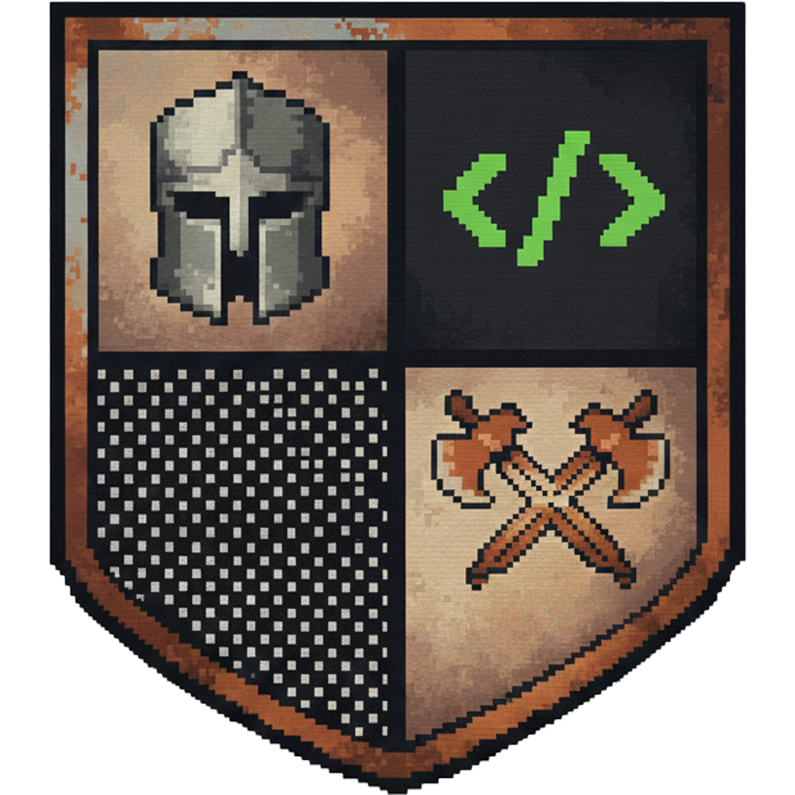
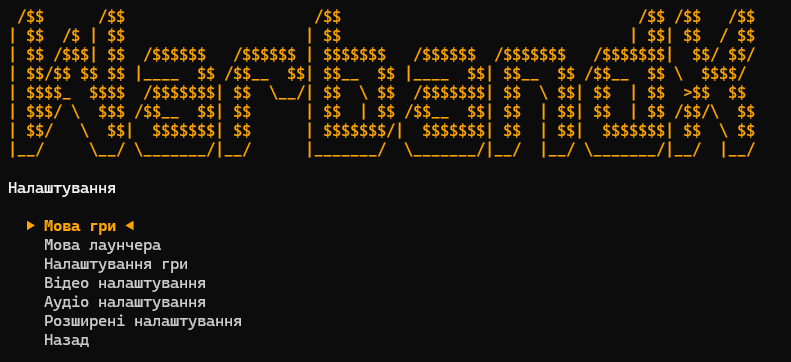

# 🎮 WarbandX

<div align="center">
   
   
</div>

A modern, open-source command-line launcher for **Mount & Blade: Warband** with comprehensive multi-language support and WSE2 integration.


## ✨ Features

### 🌍 Native Language Support
WarbandX supports **any language** without requiring language files to be placed in `en` or `ru` folders. For example, Ukrainian language files can be placed directly in the `uk` folder, making localization management much more intuitive and organized.

### 🔓 Open Source
Fully open-source codebase, allowing you to inspect, modify, and contribute to the project. Perfect for transparency and community-driven improvements.

### 🛠️ Customizable Codebase
WarbandX provides an excellent foundation for creating your own custom launchers. The code is well-structured, documented, and easy to extend with new features.

### ⚔️ WSE2 Support
Partial support for **Warband Script Enhancer 2 (WSE2)**, allowing you to launch WSE2-enabled modules directly from the launcher.

### 🎨 Modern CLI Interface
- Clean and easy interface
- Real-time language switching

### ⚙️ Comprehensive Settings Management
- **Game Settings**: Blood toggle, cheat mode
- **Video Settings**: Resolution, framerate, VSync, antialiasing, shadow quality, and more
- **Audio Settings**: Sound, music, and variation controls
- **Advanced Settings**: Edit mode, single threading

## 📋 Requirements

- **Python 3.12+**
- **Windows 10/11**
- **Mount & Blade: Warband** (installed)

## 🚀 Installation

1. Clone the repository:
```bash
git clone https://github.com/onysd128/WarbandX.git
cd WarbandX
```
2. Run the launcher:
```bash
python cli_launcher.py
```

## 📦 Building Executable

To build a standalone executable:

1. Install PyInstaller:
```bash
pip install pyinstaller
```

2. Build the executable:
```bash
pyinstaller --onefile --console --icon=icons/icon.ico cli_launcher.py
```

Or use `auto-py-to-exe` for a GUI-based build process.

## 🎯 Usage

### Basic Usage

1. Launch `warbandx.exe` or run `python cli_launcher.py`
2. If multiple Warband installations are found, select the desired one
3. Choose your module from the list
4. Select your preferred game language
5. Click **Play** to start the game

### WSE2 Launch

If `mb_warband_wse2.exe` is detected in your game directory, a **Play (WSE2)** option will appear in the main menu. This option launches WSE2 with the selected module automatically.

### Settings

Access the **Settings** menu to configure:
- Game language (affects in-game text)
- Launcher language (affects launcher interface)
- Game, video, audio, and advanced settings

## 🌐 Supported Languages

WarbandX launcher interface supports the following languages:

| Code | Language | Native Name |
|------|----------|-------------|
| `en` | English | English |
| `uk` | Ukrainian | Українська |
| `be` | Belarusian | Беларуская |
| `ro` | Romanian | Română |
| `pl` | Polish | Polski |
| `tr` | Turkish | Türkçe |
| `ja` | Japanese | 日本語 |
| `zh` | Chinese | 中文 |
| `ko` | Korean | 한국어 |

**Note**: The launcher supports any game language code. Language names are displayed in their native script when selecting the game language.

## 🔧 Configuration

### Language Storage

- **Game Language**: Stored in `%USERPROFILE%\Documents\Mount&Blade Warband\language.txt`
- **WSE2 Language**: Stored in `%APPDATA%\Mount&Blade Warband WSE2\language.txt`
- **Launcher Language**: Stored in Windows Registry (`HKEY_CURRENT_USER\Software\MountAndBladeWarbandKeys\launcher_language`)

### Auto-Detection

If `mb_warband.exe` is found in the same directory as the launcher, the installation search is skipped automatically.

## 🎨 Customization

### Adding New Languages

To add support for a new launcher language:

1. Add the language code to `LAUNCHER_LANGUAGES` list
2. Add translations to the `TRANSLATIONS` dictionary
3. Implement `get_launcher_language_name()` for native name display

### Modifying Menu Options

All menu functions are modular and can be easily extended. Check the `settings_menu()`, `game_settings_menu()`, `video_settings_menu()`, etc. functions for customization examples.

## 🐛 Troubleshooting

### Game Won't Launch

- Ensure Steam is running if using a Steam version
- Check that `mb_warband.exe` exists in the selected installation directory
- Verify module folder structure is correct

### Language Not Working

- Ensure language files exist in the game's `Languages` folder
- Check that `language.txt` is saved correctly
- For WSE2, verify the language is saved in AppData folder

## 📝 License

This project is licensed under the MIT License - see the LICENSE file for details.

## 🤝 Contributing

Contributions are welcome! Please feel free to submit a Pull Request. Areas for contribution:

- Additional language translations
- Bug fixes
- Feature enhancements
- Documentation improvements

## 📚 Language File Structure

Understanding how Mount & Blade: Warband handles language files is crucial for proper localization. Below is the complete mapping of where language files should be placed:

### Root Folder Structure

```
rootfolder/
├── languages/
│   └── {language_code}/          # e.g., uk, en, ru, de
│       ├── hints.csv             # Hints and tooltips
│       ├── ui.csv                # User interface strings
│       ├── uimain.csv            # Main menu interface
│       └── wse2.csv              # WSE2-specific strings (if applicable)
│
├── Textures/
│   └── languages/
│       └── {language_code}/      # Language-specific textures
│           └── font.dds          # Font texture file
│
└── Data/
    └── languages/
        └── {language_code}/      # Font data applied to font texture
```

### Module-Specific Structure

```
rootfolder/
└── Modules/
    └── {module_name}/
        ├── languages/
        │   └── {language_code}/  # Game strings for your module
        │
        ├── Data/
        │   └── languages/
        │       └── {language_code}/  # Font data for your module
        │
        └── Textures/
            └── languages/
                └── {language_code}/  # Textures for your language for your module
```

### File Descriptions

- **`hints.csv`**: Contains hints and tooltips displayed throughout the game
- **`ui.csv`**: General user interface strings (buttons, labels, etc.)
- **`uimain.csv`**: Main menu interface strings
- **`wse2.csv`**: WSE2-specific interface strings (if using WSE2)
- **`font.dds`**: Font texture file containing glyphs for the language
- **Font data files**: Configuration files that map characters to positions in the font texture

### Language Code Examples

- `uk` - Ukrainian
- `en` - English
- `ru` - Russian
- `de` - German
- `fr` - French
- `pl` - Polish
- `tr` - Turkish
- `ja` - Japanese
- `zh` - Chinese
- `ko` - Korean

### Example: Adding Ukrainian Language

To add Ukrainian language support to your game:

1. Create folder structure:
   ```
   rootfolder/languages/uk/
   rootfolder/Textures/languages/uk/
   rootfolder/Data/languages/uk/
   ```

2. Add translation files:
   - `rootfolder/languages/uk/hints.csv`
   - `rootfolder/languages/uk/ui.csv`
   - `rootfolder/languages/uk/uimain.csv`

3. Add font texture:
   - `rootfolder/Textures/languages/uk/font.dds`

4. Add font data:
   - `rootfolder/Data/languages/uk/` (font configuration files)

5. For modules, repeat the same structure under `Modules/{module_name}/`

WarbandX will automatically detect and use these language files when you select the corresponding language code in the launcher.

---

**Made with ❤️ for the Mount & Blade: Warband community**
